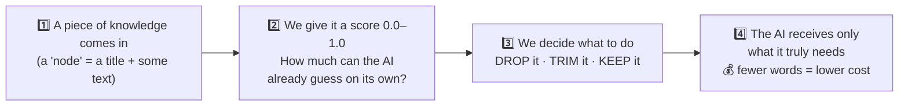
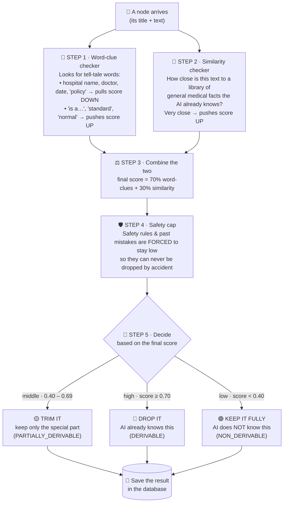
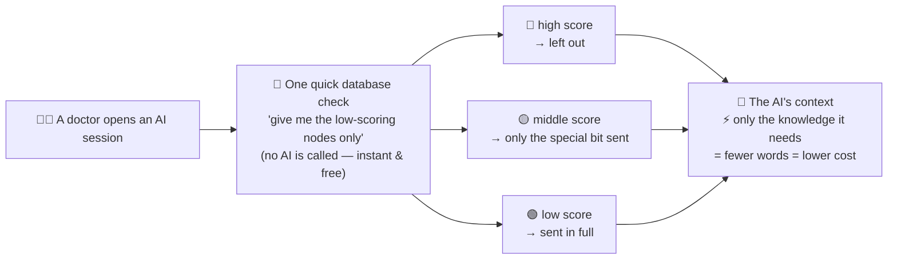
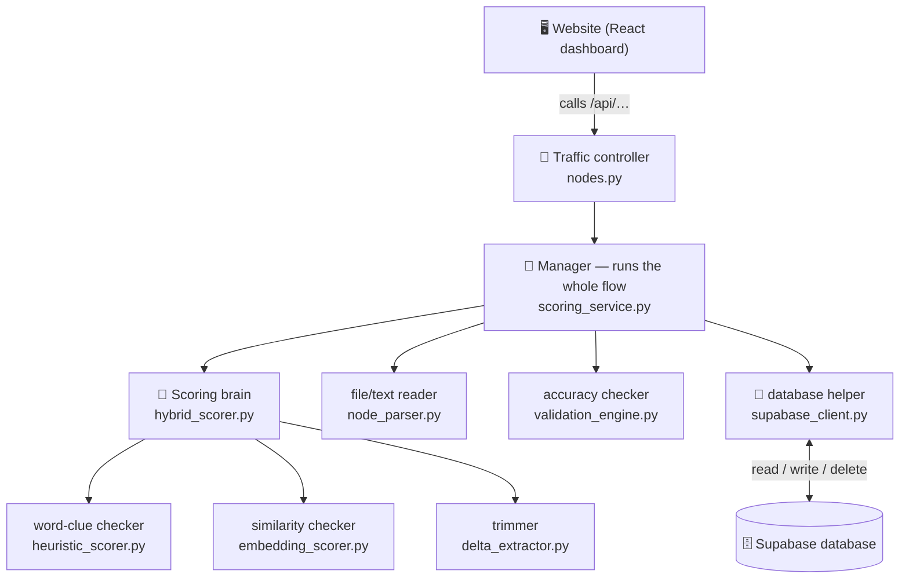
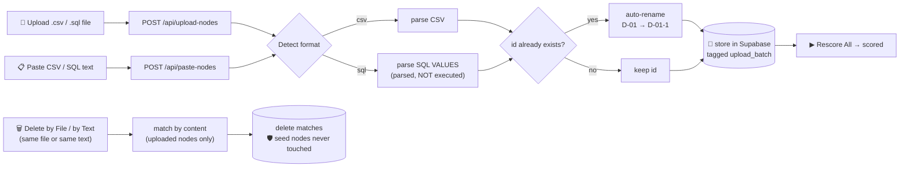

# BRAHMO Derivability Scoring System — Full Documentation

> **Token Savings Engine** · Pre-compute knowledge-node derivability · **Zero LLM calls at query time**

**Assessment:** Developer Assessment 8 — Option A (Build & Demo)
**Stack:** Supabase (PostgreSQL) · Python / FastAPI · React · Tailwind CSS
**Deliverables:** Working demo · Source code · Architecture notes (this document)

---

## Table of Contents

1. [Project Overview](#1-project-overview)
2. [The Problem & Mental Model](#2-the-problem--mental-model)
3. [System Architecture](#3-system-architecture)
4. [Tech Stack](#4-tech-stack)
5. [Project Structure](#5-project-structure)
6. [Database Design](#6-database-design)
7. [Scoring Engine — Design & Implementation](#7-scoring-engine--design--implementation)
   - 7.1 [Approach Selection & Tradeoffs](#71-approach-selection--tradeoffs)
   - 7.2 [Heuristic Scorer](#72-heuristic-scorer)
   - 7.3 [TF-IDF Scorer](#73-tf-idf-scorer)
   - 7.4 [Hybrid Fusion](#74-hybrid-fusion)
   - 7.5 [Type Safety Floors](#75-type-safety-floors)
   - 7.6 [Classification Logic](#76-classification-logic)
   - 7.7 [Delta Extractor (PARTIALLY_DERIVABLE)](#77-delta-extractor-partially_derivable)
8. [Edge Cases & False-Positive Safeguards](#8-edge-cases--false-positive-safeguards)
9. [Token Savings & Cost Impact](#9-token-savings--cost-impact)
10. [Validation, Metrics & Calibration](#10-validation-metrics--calibration)
11. [Uploading & Deleting Nodes](#11-uploading--deleting-nodes)
12. [API Reference](#12-api-reference)
13. [Data Models](#13-data-models)
14. [Frontend Dashboard](#14-frontend-dashboard)
15. [Setup & Installation](#15-setup--installation)
16. [Running the Application](#16-running-the-application)
17. [Running Tests](#17-running-tests)
18. [Seed Data (30 Nodes)](#18-seed-data-30-nodes)
19. [Design Decisions — Open-Ended Problems](#19-design-decisions--open-ended-problems)
20. [Demo Scenarios & Surprise Test](#20-demo-scenarios--surprise-test)
21. [Common Pitfalls & How We Avoid Them](#21-common-pitfalls--how-we-avoid-them)
22. [Requirements & Evaluation Mapping](#22-requirements--evaluation-mapping)
23. [Future Improvements](#23-future-improvements)
- [Appendix A — Quick Reference Commands](#appendix-a--quick-reference-commands)
- [Appendix B — Scoring Signal Reference](#appendix-b--scoring-signal-reference)

---

## 1. Project Overview

### What is BRAHMO Derivability?

When an AI assistant session starts at **Supra Multi-Specialty Hospital**, the **Rules Engine** (Layer 2 of BRAHMO's knowledge infrastructure) assembles a set of candidate knowledge nodes to inject into the AI's context window. Many of these nodes contain **general medical knowledge** the AI already knows from training, for example:

- *"What is Total Knee Replacement (TKR)?"*
- *"Paracetamol mechanism of action"*
- *"Normal adult vital sign ranges"*

Injecting these wastes context tokens on information the model can already derive. The **Derivability Scoring System** solves this by **pre-computing a score (0.0–1.0)** for every node that represents how much of its content an AI can independently derive — then filtering at query time with a single database `WHERE` clause.

### The Three Classifications

| Class | Score Range | Action | Effect |
|---|---|---|---|
| **DERIVABLE** | ≥ 0.70 | Exclude entirely | Full token savings |
| **PARTIALLY_DERIVABLE** | 0.40 – 0.69 | Send the org-specific *delta* only | Partial savings |
| **NON_DERIVABLE** | < 0.40 | Include full content | No savings (correctly preserved) |

### Core Guarantee

> **Zero LLM calls at query time.** All scoring happens in a background batch process. At query time, the Rules Engine performs a single deterministic SQL comparison — `WHERE derivability_score < threshold` — with no computation and no model inference.

### Key Outcomes (30 seed nodes, threshold = 0.70)

| Metric | Value |
|--------|-------|
| Total tokens | ~1,800 |
| Tokens saved | ~600 |
| Savings percentage | **~34.5%** |
| Per-session cost savings | ~$0.009 |
| Annual savings (50 engineers) | **~$1,125** |
| Annual savings (500 engineers) | **~$11,250** |

---

## 2. The Problem & Mental Model

### Why this matters

Across a typical candidate set, **40–60%** of nodes contain knowledge derivable from general training data. Excluding them saves ~1,200–1,800 tokens per session. The constraint is absolute: the Rules Engine (L2) is **deterministic and binary** — it cannot call an LLM to ask "is this derivable?" because that would add latency, cost tokens, and violate the L2/L3 separation. The score must therefore be **pre-computed**.

### Mental model — a spam filter for AI context

Derivability scoring is a **spam filter for the context window**. Just as a spam filter keeps junk mail out of your inbox, the derivability filter keeps "junk tokens" (knowledge the AI already has) out of the context budget. Both must be:

- **Pre-computed** — the filter already ran; you don't run it per request.
- **Conservative by default** — a false positive (dropping an important message/node) is worse than a false negative (letting a known item through).
- **Tunable** — the threshold is adjustable without code changes.
- **Type-aware** — mail from your boss is never spam; **CONSTRAINT nodes are never fully derivable**.

### The single most important principle

> **A false positive is far more dangerous than a false negative.**
>
> - **False positive** — excluding an org-specific node the AI doesn't know → the AI gives generic/wrong advice → **patient-safety risk**. ⚠️
> - **False negative** — including a node the AI already knows → **wasted tokens, no harm**. ✓
>
> Every design decision below is biased toward inclusion: type floors, a neutral base score, strong negative-signal weights, and a conservative default threshold.

---

## 3. System Architecture

This section is told as a simple story. Read the four diagrams top-to-bottom — each one has a one-line
plain-English summary below it. No background knowledge needed.

### 3.1 The whole idea in 4 steps



> **In one line:** the **higher** the score, the more the AI already knows it → the safer it is to **leave
> out** and save money. The **lower** the score, the more special/private it is → we **must keep it**.

### 3.2 How one node gets its score (the 5 steps)

Every node walks through the same 5 steps. Here is what each step actually does, in plain words:



> **In one line:** two checkers read the text, their scores are combined, a safety cap protects critical
> nodes, and the final score decides: **drop / trim / keep**.

### 3.3 Three real examples walking through

To make it concrete, here is how three real nodes come out the other end:

| The node (its text) | What the checkers notice | Score | Decision |
|---|---|:---:|---|
| *"What is Total Knee Replacement?"* | A plain textbook definition — no hospital, doctor, or date | **0.92** | 🔴 **DROP** — the AI already knows it |
| *"DVT prophylaxis… **at Supra**, the dose is set by the formulary committee."* | General medical protocol **plus** a Supra-only rule | **0.52** | 🟡 **TRIM** — keep only the Supra part |
| *"**Dr. Mehta** decided in **March 2024** after **12 readmissions**."* | Doctor name + date + count = clearly hospital-specific | **0.08** | 🟢 **KEEP** in full — the AI can't know this |

### 3.4 At question time — where the money is saved



> **In one line:** all the hard work (scoring) was done **earlier, once**. When a doctor asks a question,
> the system only does a quick database lookup — **no AI, no waiting, no extra cost.**

### 3.5 Behind the scenes — which file does which job (for developers)



> **In one line:** the website calls the **traffic controller**, which hands the work to the **manager**;
> the manager uses the **scoring brain** (three small helpers) and saves everything through the
> **database helper**.

---

## 4. Tech Stack

| Layer | Technology | Version | Purpose |
|-------|-----------|---------|---------|
| **Backend framework** | FastAPI | 0.115.6 | REST API, async request handling |
| **ASGI server** | Uvicorn | 0.34.0 | Async server |
| **File uploads** | python-multipart | 0.0.32 | Parses multipart form data for node uploads |
| **NLP** | spaCy (`en_core_web_sm`) | 3.8.4 | Named Entity Recognition, sentence segmentation |
| **ML** | scikit-learn | 1.6.1 | TF-IDF vectorizer, cosine similarity |
| **Numerics** | NumPy | 2.2.3 | Vector operations |
| **Data validation** | Pydantic | 2.10.5 | Request/response schema validation |
| **Database** | Supabase (PostgreSQL) | 2.11.0 | Node storage, score persistence |
| **Env management** | python-dotenv | 1.0.1 | `.env` loading |
| **Testing** | pytest + httpx | 8.3.4 / 0.28.1 | Unit & integration tests |
| **Frontend** | React 18 + Vite 5 | — | Dashboard SPA |
| **Styling** | Tailwind CSS 3 | — | Utility-first CSS |
| **Charts** | Chart.js + react-chartjs-2 | — | Threshold analysis charts |

> **Cost: $0.** Heuristic + TF-IDF approaches use no paid APIs. There is **zero LLM cost at query time** and no embedding-API cost (TF-IDF is computed locally with scikit-learn).

---

## 5. Project Structure

```
BD/                                         ← Project root
├── README.md                               ← Quick-start guide (industry-style, Mermaid diagrams)
├── DOCUMENTATION.md                        ← This file (full architecture & design docs)
├── EXPLANATION.md                          ← Plain-language, file-by-file walkthrough
├── INTERVIEW_PREP.md                       ← Concepts (precision/recall/TF-IDF) + interview Q&A
├── CLAUDE.md                               ← Guidance for Claude Code / AI agents
├── .gitignore                              ← Excludes .env, venv, node_modules, build
├── requirements.txt                        ← Top-level Python dependencies
│
├── backend/
│   ├── .env / .env.example                 ← Supabase credentials (.env is gitignored)
│   ├── requirements.txt                    ← Python dependencies
│   └── app/
│       ├── main.py                         ← FastAPI app entry point, CORS config
│       ├── api/routers/nodes.py            ← All REST endpoints (+ upload, delete-by-file)
│       ├── models/schemas.py               ← All Pydantic request/response models
│       ├── scorer/
│       │   ├── heuristic_scorer.py         ← Rule-based scorer (spaCy NER + regex)
│       │   ├── embedding_scorer.py         ← TF-IDF cosine similarity scorer
│       │   ├── hybrid_scorer.py            ← Score fusion + type floors + classification
│       │   ├── delta_extractor.py          ← Extract org-specific portion from mixed content
│       │   └── reference_corpus.py         ← ~54 general medical knowledge entries
│       ├── services/
│       │   ├── scoring_service.py          ← Orchestration (API ↔ scorers ↔ DB), upload/delete
│       │   ├── node_parser.py              ← Parses uploaded CSV/SQL into node dicts
│       │   └── supabase_client.py          ← Supabase CRUD operations
│       ├── validators/validation_engine.py ← Precision, recall, F1, confusion matrix
│       ├── utils/token_counter.py          ← Token counting & cost projection formulas
│       └── tests/                          ← pytest suite (heuristic, tfidf, hybrid,
│                                              delta, thresholds, surprise nodes, api)
│
├── frontend/
│   └── src/
│       ├── App.jsx                         ← Root component, global state, API calls
│       ├── api/client.js                   ← Centralized API client functions
│       └── components/                     ← 11 React components
│           ├── Header.jsx       Controls.jsx       UploadNodes.jsx   PasteNodes.jsx
│           ├── TestPlayground.jsx (🧪 live scorer tab)
│           ├── StatsCards.jsx   NodeTable.jsx      NodeModal.jsx
│           └── ValidationMatrix.jsx  ThresholdChart.jsx  TokenSavings.jsx
│
├── database/
│   ├── schema.sql                          ← Table definitions (incl. upload_batch)
│   ├── seed.sql                            ← 30 knowledge nodes
│   ├── add_upload_batch_column.sql         ← Migration: enables seed-safe deletes
│   ├── add_nodes_template.sql              ← Template for adding nodes via SQL
│   └── nodes_import_template.csv           ← Template for CSV upload/import
│
├── sample_datasets/                        ← Dummy datasets for testing ingestion
│   ├── cardio_pulmo_dataset.sql            ← 15 nodes (Cardiology & Pulmonology)
│   ├── peds_neuro_dataset.csv              ← 15 nodes (Pediatrics & Neurology)
│   └── paste_test_nodes.md                 ← 6 nodes in CSV + SQL, for the Paste Nodes box
│
└── docs/
    ├── architecture.md                     ← Algorithm design deep-dive
    └── implementation_plan.md              ← Development phase notes
```

---

## 6. Database Design

### Table: `organizations`

| Column | Type | Description |
|--------|------|-------------|
| `id` | TEXT PK | Organization identifier (e.g., `"supra"`) |
| `name` | TEXT | Display name |
| `config` | JSONB | Org-level config (`derivability_threshold`, `type_floors`) |

### Table: `knowledge_nodes`

| Column | Type | Default | Description |
|--------|------|---------|-------------|
| `id` | TEXT PK | — | Node identifier (e.g., `"D-01"`, `"ND-07"`) |
| `org_id` | TEXT FK | — | Owning organization |
| `type` | TEXT | — | `CONSTRAINT` \| `DECISION` \| `ANTI_PATTERN` \| `FACT` |
| `title` | TEXT | — | Short node title |
| `content` | TEXT | — | Full knowledge content (the text that gets scored) |
| `importance` | DECIMAL(3,2) | — | Business importance weight (0–1) |
| `derivability_score` | DECIMAL(3,2) | `0.5` | Pre-computed score (0–1) |
| `derivability_class` | TEXT | `'UNKNOWN'` | `DERIVABLE` \| `PARTIALLY_DERIVABLE` \| `NON_DERIVABLE` \| `UNKNOWN` |
| `non_derivable_portion` | TEXT | NULL | Extracted delta for PARTIAL nodes |
| `expected_derivability` | TEXT | NULL | Ground-truth label (for validation) |
| `expected_score_range` | TEXT | NULL | Expected score range string |
| `department` | TEXT | NULL | Hospital department tag |
| `tokens_full` | INTEGER | NULL | Token count of full content |
| `tokens_delta` | INTEGER | NULL | Token count of delta content |
| `scoring_reason` | TEXT | NULL | Human-readable score explanation |
| `type_floor_applied` | BOOLEAN | `FALSE` | Whether a safety floor capped the score |
| `upload_batch` | TEXT | NULL | Tags nodes added via upload (`NULL` = seed/manual; protected from Delete by File) |
| `created_at` | TIMESTAMPTZ | `NOW()` | Creation timestamp |

**Indexes:** `org_id`, `type`, `derivability_score` (query-time filter), `derivability_class`, `upload_batch`.

### Setup Steps

```
1. supabase.com → create project "brahmo-derivability"
2. SQL Editor → run schema.sql
3. SQL Editor → run seed.sql
4. Verify: SELECT COUNT(*) FROM knowledge_nodes;  → 30
```

### Migration — `add_upload_batch_column.sql`

The **Delete by File** feature uses `upload_batch` to distinguish uploaded nodes from seed nodes. On an existing database, run once and restart the backend:

```sql
ALTER TABLE knowledge_nodes ADD COLUMN IF NOT EXISTS upload_batch TEXT;
CREATE INDEX IF NOT EXISTS idx_knowledge_nodes_upload_batch ON knowledge_nodes(upload_batch);
```

> The upload/delete features degrade gracefully without the column, but **only with it are the original seed nodes guaranteed safe** from Delete by File.

---

## 7. Scoring Engine — Design & Implementation

> This is the core of the assessment (the open-ended 25–30%). The design is intentionally **explainable** — every score carries a human-readable `scoring_reason` listing the signals that fired.

### 7.1 Approach Selection & Tradeoffs

Three approaches were considered. We implement **all three** (selectable at request time) and default to **Hybrid**.

| Approach | Strengths | Weaknesses |
|----------|-----------|------------|
| **Heuristic** (rule-based) | Fast, free, deterministic, fully interpretable; catches obvious org names/persons/dates | Misses subtle org-specific content without explicit markers |
| **TF-IDF** (statistical) | Handles ambiguous text; no manual rules; no API cost | No deep semantic understanding; can be fooled by shared vocabulary |
| **Hybrid** (default) | Best of both — heuristics rule on obvious cases, TF-IDF resolves the ambiguous middle | Slightly more complex; fusion weights need tuning |

**Why not sentence-transformer embeddings?** For separating "general medical text" from "org-specific text," vocabulary overlap is a strong enough signal. TF-IDF is **free, deterministic, and requires no model download or API**, satisfying the zero-cost constraint. Semantic embeddings are reserved as a [future improvement](#23-future-improvements).

### 7.2 Heuristic Scorer

**File:** `backend/app/scorer/heuristic_scorer.py`

Combines spaCy NER (`PERSON`, `DATE`, `ORG`) with regex patterns. Every node starts at a neutral **base score of 0.50**; signals add or subtract, and the result is clamped to `[0.0, 1.0]`.

```python
score = 0.50                       # BASE_SCORE (neutral)
for signal in all_signals:
    score += signal.weight         # negative weights subtract
score = max(0.0, min(1.0, score))
```

**Positive signals (toward DERIVABLE):**

| Signal | Weight | Detection |
|--------|:------:|-----------|
| `definition_pattern` | **+0.30** | Regex: *"X is a/an…"*, *"also known as"*, *"what is"* |
| `textbook_structure` | **+0.20** | Short (< 60 words) + ≥ 3 medical terms + no org refs |
| `standard_keyword` | **+0.20** | *standard, normal, common, typical, usual, universal* |
| `generic_terminology_density` | **+0.20** | Medical-term density > 8% and ≥ 3 terms |
| `no_org_references` | **+0.10** | No organization names present |

**Negative signals (toward NON_DERIVABLE):**

| Signal | Weight | Detection |
|--------|:------:|-----------|
| `org_name_present` | **−0.40** | String match against configured org names ("Supra", …) |
| `person_name_present` | **−0.30** | spaCy `PERSON` entity + `Dr.` regex |
| `incident_reference` | **−0.30** | *incident, near-miss, readmission, adverse/sentinel event* |
| `patient_reference` | **−0.30** | *"Patient [Name]"*, *"Mrs./Mr."* |
| `specific_date_present` | **−0.20** | spaCy `DATE` + regex (Month YYYY, FYYYY, Q1 2024) |
| `policy_protocol_with_org` | **−0.20** | *policy/protocol* co-occurring with an org name |
| `decision_rationale` | **−0.20** | *because, reviewed, updated, decided, approved, rationale* |
| `specific_count` | **−0.10** | Counts/measures (*"8 refusals"*, *"45 beds"*, ₹/\$/€ figures) |

### 7.3 TF-IDF Scorer

**File:** `backend/app/scorer/embedding_scorer.py`

Computes cosine similarity between node content and a curated **reference corpus** of **~54** general medical knowledge entries (definitions, drug mechanisms, vital ranges, standard protocols, assessment tools). High similarity → general/textbook → more derivable.

```python
vectorizer = TfidfVectorizer(stop_words="english", max_features=5000,
                             ngram_range=(1, 2), sublinear_tf=True)
corpus_vectors = vectorizer.fit_transform(REFERENCE_CORPUS)   # fit once at startup

sims      = cosine_similarity(vectorizer.transform([f"{title} {content}"]), corpus_vectors)
max_sim   = sims.max()
top3_mean = sims[0].sort()[-3:].mean()
blended   = 0.7 * max_sim + 0.3 * top3_mean      # robustness blend
scaled    = min(1.0, blended * 2.5)              # raw sims cluster low; scale to fill 0–1
```

### 7.4 Hybrid Fusion

**File:** `backend/app/scorer/hybrid_scorer.py`

```python
if   algorithm == "heuristic": raw = heuristic_score
elif algorithm == "tfidf":     raw = tfidf_score
else:                          raw = 0.70 * heuristic_score + 0.30 * tfidf_score   # default
raw = max(0.0, min(1.0, raw))
```

**Why 70/30?** Heuristics are hand-crafted for the domain and reliable on unambiguous cases (org names, persons, dates). TF-IDF is a statistical safety net for the ambiguous middle. Giving heuristics primary authority prevents shared medical vocabulary from falsely marking org-specific content as derivable.

### 7.5 Type Safety Floors

A **critical safety mechanism**: a per-type ceiling applied *after* fusion, capping the score no matter how general the content sounds.

| Node Type | Max Score (Cap) | Rationale |
|-----------|:--------------:|-----------|
| **CONSTRAINT** | **0.50** | Safety-critical. Even general-sounding constraints may carry org-specific targets. Never fully excluded. |
| **ANTI_PATTERN** | **0.60** | Past incidents are inherently org-specific and must be preserved. |
| **DECISION** | 1.00 (no cap) | Already penalized by heuristics (org names, dates, persons). |
| **FACT** | 1.00 (no cap) | Ranges from fully general to fully org-specific; signals handle it. |

```python
max_allowed = TYPE_FLOORS.get(node_type, 1.0)
if final_score > max_allowed:
    final_score = max_allowed
    type_floor_applied = True
```

**Example:** *"WHO 5-moment hand hygiene compliance"* — the AI knows the WHO 5 moments, so the scorer might assign ~0.75 → DERIVABLE → **excluded**. But Supra's target (95%), current compliance (88%), and reportable non-compliance are org-specific. The CONSTRAINT floor caps it at 0.50 → PARTIALLY_DERIVABLE → the org-specific delta is preserved. ✓

> Floors and type ceilings are configurable per organization via `organizations.config.type_floors`.

### 7.6 Classification Logic

```python
def classify(score, threshold=0.70):
    if   score >= threshold: return "DERIVABLE"
    elif score >= 0.40:      return "PARTIALLY_DERIVABLE"
    else:                    return "NON_DERIVABLE"
```

> The `0.40` partial floor is shared across the scorer, metrics, token-savings, and validation logic — they move together.

### 7.7 Delta Extractor (PARTIALLY_DERIVABLE)

**File:** `backend/app/scorer/delta_extractor.py`

For PARTIAL nodes, extracts only the **org-specific portion** (the "delta") — the sentences an AI cannot derive — so the context carries just those instead of the full text.

**Algorithm:** split into sentences (spaCy) → keep sentences containing org-specific markers (org name, `PERSON`, dated `DATE`, patient reference, ₹/\$/€ figures, or keywords like *policy, protocol, incident, formulary, HOD, reportable, auto-alert*) → join the kept sentences.

**Example:**
- **Full (80 tokens):** *"ALL ortho surgical patients receive DVT prophylaxis: Enoxaparin 40mg SC daily starting 12 hours post-op. Duration: 14 days for TKR, 28 days for THR…"*
- **Delta (25 tokens):** *"Supra: Enoxaparin 12h post-op. TKR 14d, THR 28d. Active bleeding/platelet <50K contraindicated."*
- **Saved: 55 tokens** from one PARTIAL node.

**Conservative fallback:** if no org-specific sentences are detected, the **full content is returned** — when in doubt, include.

---

## 8. Edge Cases & False-Positive Safeguards

The asymmetric-risk principle ([§2](#2-the-problem--mental-model)) drives multiple layers of protection against the dangerous case (excluding org-specific knowledge):

| Safeguard | Mechanism |
|-----------|-----------|
| **Type-based floors** | CONSTRAINT ≤ 0.50, ANTI_PATTERN ≤ 0.60 — safety-critical nodes can never be classified DERIVABLE at default threshold |
| **Conservative default threshold** | 0.70 leaves a wide safety buffer; tunable per org |
| **Neutral base score** | Heuristic starts at 0.50, so content must earn DERIVABLE through positive signals |
| **Strong negative weights** | Org name −0.40, person/incident/patient −0.30 quickly pull org-specific content down |
| **Conservative delta fallback** | If the delta can't be isolated, the full node is kept |
| **Audit trail** | Every node stores a `scoring_reason`; the dashboard flags false positives in the validation matrix |
| **Ground-truth validation** | `expected_derivability` enables monthly precision/recall measurement (see [§10](#10-validation-metrics--calibration)) |

---

## 9. Token Savings & Cost Impact

**File:** `backend/app/utils/token_counter.py`

### Per-node savings

```python
if   classification == "DERIVABLE":            saved = tokens_full          # whole node excluded
elif classification == "PARTIALLY_DERIVABLE":  saved = tokens_full - tokens_delta  # delta only
else:                                          saved = 0                    # full content kept
```

### Aggregate & cost projection

```python
total_tokens = sum(tokens_full)
saved_tokens = sum(per-node saved)
savings_pct  = saved_tokens / total_tokens * 100

COST_PER_TOKEN         = 0.015 / 1000          # baseline LLM pricing assumption
session_savings        = saved_tokens × COST_PER_TOKEN
daily_savings_50_eng   = session_savings × 10 sessions × 50 engineers
annual_savings_50_eng  = daily_savings_50_eng × 250 working days
annual_savings_500_eng = annual_savings_50_eng × 10
```

The dashboard's **threshold slider** makes the savings-vs-safety tradeoff visible: lowering the threshold (e.g. 0.70 → 0.50) increases savings but raises false-positive risk; raising it (→ 0.90) is safer but saves less.

---

## 10. Validation, Metrics & Calibration

**File:** `backend/app/validators/validation_engine.py`

Each seed node carries an `expected_derivability` ground-truth label. The validation engine compares the scorer's output against these labels.

### Confusion matrix

| | Actually DERIVABLE | Actually NON/PARTIAL |
|--|:--:|:--:|
| **Scored DERIVABLE** | True Positive ✓ | **FALSE POSITIVE ✗ (danger)** |
| **Scored NON_DERIVABLE** | False Negative (waste) | True Negative ✓ |

### Metrics & targets

| Metric | Formula | Target | Meaning |
|--------|---------|:------:|---------|
| **Precision** | TP / (TP + FP) | ≥ 85% | Of nodes we excluded, what % were truly derivable? |
| **Recall** | TP / (TP + FN) | ≥ 70% | Of truly derivable nodes, what % did we catch? |
| **F1 Score** | 2·P·R / (P + R) | maximize | Harmonic mean |
| **False Positive Rate** | FP / (FP + TN) | < 5% | Rate of dangerous exclusions |

**Optimal threshold** is computed as the threshold that **maximizes F1 subject to precision ≥ 0.85** — encoding the bias toward safety.

### Calibration strategy (accuracy over time)

> *"After 6 months you have 1,042 nodes — 200 manually classified by doctors, 842 scored by the algorithm. How do you measure accuracy?"*

Use the **200 manually classified nodes as ground truth**. Compare algorithm scores against the manual labels; compute **precision** (of excluded nodes, how many were actually derivable?) and **recall** (of actually derivable nodes, how many were caught?). **False-positive rate is the critical metric** — excluding org-specific knowledge is dangerous. Run this comparison **monthly** and tune the threshold (and signal weights) per organization. The `/api/threshold-analysis` endpoint already produces the threshold-vs-metrics curve that drives this tuning.

---

## 11. Uploading & Deleting Nodes

The 30 seed nodes are not a fixed limit — datasets can be added and removed from the dashboard. There are
**two ways to add** (file upload or pasted text) and **two ways to remove** (by file or by text), all
sharing the same backend logic: `ScoringService.import_nodes()` for adds and
`ScoringService.delete_nodes_by_file()` for deletes.



### Adding nodes — file or text

Both paths accept **CSV** or **SQL** and behave identically once parsed:

- **CSV** — header row mapping to `knowledge_nodes` columns (template: `database/nodes_import_template.csv`).
- **SQL** — `INSERT INTO knowledge_nodes (...) VALUES (...)` statements like `seed.sql`. **The SQL is
  parsed, not executed** — an uploaded/pasted file can never run arbitrary statements against the database.
- **No node is ever dropped:** duplicate ids are auto-renamed (`D-01` → `D-01-1`) and reported back.
- `org_id` defaults to `supra`; invalid/missing `type` defaults to `FACT`; `importance` defaults to `0.5`.
- Nodes are stored **unscored** and tagged with an `upload_batch`; run **Rescore All** to score them.

| Method | UI control | Endpoint |
|--------|-----------|----------|
| **Upload file** | *Upload Nodes* box → choose `.csv`/`.sql` → **Upload** | `POST /api/upload-nodes` |
| **Paste text** | *Paste Nodes* box → paste text → format (Auto/CSV/SQL) → **Save to Database** | `POST /api/paste-nodes` |

### Removing nodes — by file or by text

Give the **same input** again; nodes are matched **by content** (so renamed ids still match) and only
uploaded/pasted nodes are eligible — **the original seed nodes are never matched** (guaranteed when the
`upload_batch` column exists). Re-supplying the input re-inserts the nodes.

| Method | UI control | Endpoint |
|--------|-----------|----------|
| **Delete by File** | *Upload Nodes* box → **Delete by File** → choose the same file | `POST /api/nodes/delete-by-file` |
| **Delete by Text** | *Paste Nodes* box → paste the same text → **Delete by Text** | `POST /api/nodes/delete-by-text` |

### Sample datasets

| File | Format | Theme | Nodes |
|------|--------|-------|:----:|
| `sample_datasets/cardio_pulmo_dataset.sql` | SQL (file upload) | Cardiology & Pulmonology | 15 |
| `sample_datasets/peds_neuro_dataset.csv` | CSV (file upload) | Pediatrics & Neurology | 15 |
| `sample_datasets/paste_test_nodes.md` | CSV **and** SQL (copy-paste) | Mixed — for the Paste Nodes box | 6 |

`paste_test_nodes.md` holds the same 6 nodes in both formats (covering all three classes), ready to copy
straight into the **Paste Nodes** box for instant testing.

---

## 12. API Reference

**Base URL:** `http://localhost:8000` · **Swagger UI:** `http://localhost:8000/docs`

| Endpoint | Method | Description |
|----------|--------|-------------|
| `/api/nodes` | GET | List all nodes with current scores |
| `/api/score-all` | POST | Score all nodes (batch) |
| `/api/score-node` | POST | Score a single node by id or ad-hoc content (surprise test) |
| `/api/upload-nodes` | POST | Upload a CSV/SQL **file** of nodes (stored unscored) |
| `/api/paste-nodes` | POST | Paste raw CSV/SQL **text** of nodes (stored unscored) |
| `/api/nodes/delete-by-file` | POST | Delete uploaded nodes matching a re-supplied file |
| `/api/nodes/delete-by-text` | POST | Delete uploaded nodes matching re-pasted text |
| `/api/metrics` | GET | Classification counts at a threshold |
| `/api/validation-matrix` | GET | Confusion matrix + precision/recall/F1 |
| `/api/token-savings` | GET | Token savings + cost projections |
| `/api/threshold-analysis` | GET | Threshold-vs-metrics chart data + optimal threshold |
| `/` , `/health` | GET | Health checks |

### POST `/api/score-node` (Surprise Test)

Score a node by `node_id` (from DB) **or** by raw `content` (ad-hoc). Used for the live surprise test.

```json
// Request
{ "content": "Patient Ramaiah's son keeps requesting Ibuprofen...", "node_type": "FACT", "threshold": 0.7 }
// Response
{ "result": { "final_score": 0.08, "classification": "NON_DERIVABLE", "scoring_reason": "...", "signals": [...] } }
```

### POST `/api/upload-nodes` · POST `/api/paste-nodes`

Both add nodes and return the same shape. `upload-nodes` takes `multipart/form-data` with a `file` field
(`.csv`/`.sql`); `paste-nodes` takes JSON `{ "text": "...", "format": "csv" | "sql" | null }` (format
auto-detected when `null`). Returns `{ format, parsed_count, inserted_count, batch_id, renamed[], warnings[] }`.
Duplicate ids are auto-renamed; the SQL is parsed, never executed.

```json
// POST /api/paste-nodes
{ "text": "id,org_id,type,title,content\nPT-1,supra,FACT,What is BMI,...", "format": "csv" }
```

### POST `/api/nodes/delete-by-file` · POST `/api/nodes/delete-by-text`

Both delete and return the same shape. `delete-by-file` takes `multipart/form-data` with a `file` field;
`delete-by-text` takes JSON `{ "text": "...", "format": null }`. Matches **by content** against uploaded
nodes only. Returns `{ parsed_count, deleted_count, deleted_ids[], message }`. **Seed nodes are never matched.**

### GET `/api/validation-matrix`

```json
{ "confusion_matrix": { "true_positives": 9, "false_positives": 1, "true_negatives": 8, "false_negatives": 2 },
  "precision": 0.90, "recall": 0.82, "f1_score": 0.86, "false_positive_rate": 0.11,
  "false_positive_nodes": ["E-04"], "false_negative_nodes": ["E-07","E-09"], "total_evaluated": 20 }
```

### GET `/api/token-savings`

```json
{ "total_tokens": 1800, "saved_tokens": 621, "savings_percentage": 34.5,
  "session_savings_dollars": 0.0093, "annual_savings_50_engineers": 1162.5,
  "annual_savings_500_engineers": 11625.0 }
```

---

## 13. Data Models

All models live in `backend/app/models/schemas.py` (Pydantic v2).

**Internal:** `ScoringSignal` (name, weight, description, matched_text) · `OrgConfig` (derivability_threshold, type_floors) · `KnowledgeNode` (full DB row) · `ScoringResult` (raw/heuristic/tfidf/final scores, classification, signals, reason, type_floor_applied, non_derivable_portion).

**Requests:** `ScoreAllRequest`, `ScoreNodeRequest`, `PasteNodesRequest` (`text`, optional `format`).

**Responses:**

| Model | Endpoint | Key fields |
|-------|----------|------------|
| `NodesResponse` | `GET /api/nodes` | `nodes[]`, `total` |
| `ScoreAllResponse` | `POST /api/score-all` | `scored_count`, `algorithm`, `threshold`, `results[]` |
| `ScoreNodeResponse` | `POST /api/score-node` | `result` |
| `MetricsResponse` | `GET /api/metrics` | classification counts |
| `ValidationMatrixResponse` | `GET /api/validation-matrix` | confusion matrix, precision/recall/F1, FPR |
| `TokenSavingsResponse` | `GET /api/token-savings` | token counts, %, cost projections |
| `ThresholdAnalysisResponse` | `GET /api/threshold-analysis` | `data_points[]`, `optimal_threshold` |
| `UploadNodesResponse` | `POST /api/upload-nodes`, `POST /api/paste-nodes` | `format`, `parsed_count`, `inserted_count`, `batch_id`, `renamed[]`, `warnings[]` |
| `RenamedNode` | (nested) | `original_id`, `new_id` |
| `DeleteByFileResponse` | `POST /api/nodes/delete-by-file`, `POST /api/nodes/delete-by-text` | `parsed_count`, `deleted_count`, `deleted_ids[]`, `message` |

---

## 14. Frontend Dashboard

**URL:** `http://localhost:5173` · React 18 + Vite 5 + Tailwind CSS 3 (glassmorphism dark theme).

The dashboard has **two tabs**: **📊 Dashboard** (the full scoring view) and **🧪 Test Playground** (a live
ad-hoc scorer — paste any content and see the score, classification, sub-scores, signals, and delta
instantly; nothing is saved). The tab state lives in `App.jsx`.

```
App.jsx  (state: nodes, threshold, algorithm, metrics, savings, validationMatrix, thresholdData, activeTab)
├── Header.jsx              BRAHMO branding, live status, version
├── Controls.jsx            Threshold slider (0.40–0.95), algorithm selector, Rescore All
├── UploadNodes.jsx         Upload .csv/.sql file + Delete by File (refreshes table on change)
├── PasteNodes.jsx          Paste CSV/SQL text + Save to Database + Delete by Text
├── TestPlayground.jsx      🧪 tab: live ad-hoc scoring (no DB write) — score, signals, delta
├── StatsCards.jsx          6 metric cards: Total | Derivable | Partial | Non-Derivable | Tokens Saved | Annual $
├── NodeTable.jsx           Sortable table: id, title, score bar, class badge, reason, tokens, validation ✓/✗/⚠
├── NodeModal.jsx           Node detail: full content, highlighted delta, score breakdown, signals, type floor
├── ValidationMatrix.jsx    Confusion matrix + precision/recall/F1 gauges
├── TokenSavings.jsx        Session → daily → annual cost projections
└── ThresholdChart.jsx      Chart.js: threshold vs savings%, precision, recall, FP count
```

**API client (`src/api/client.js`):** `fetchNodes`, `uploadNodes(file)`, `pasteNodes(text, format)`, `deleteNodesByFile(file)`, `deleteNodesByText(text, format)`, `scoreAll(algorithm, threshold)`, `scoreNode(nodeId, …)`, `scoreContent({content, title, nodeType, algorithm, threshold})` (live playground — no save), `fetchMetrics`, `fetchValidationMatrix`, `fetchTokenSavings`, `fetchThresholdAnalysis`.

**Vite proxy:** all `/api/*` requests proxy to `http://localhost:8000` (no CORS issues in dev).

---

## 15. Setup & Installation

**Prerequisites:** Python 3.11+, Node.js 18+, a free Supabase account.

### Database
1. Create a Supabase project.
2. SQL Editor → run `database/schema.sql`, then `database/seed.sql`.
3. Verify: `SELECT COUNT(*) FROM knowledge_nodes;` → 30.

### Backend
```bash
cd backend
python -m venv venv && venv\Scripts\activate         # Windows
pip install -r requirements.txt
python -m spacy download en_core_web_sm              # REQUIRED — scorer needs the model
cp .env.example .env                                 # fill in SUPABASE_URL / SUPABASE_KEY
```

### Frontend
```bash
cd frontend
npm install
```

---

## 16. Running the Application

```bash
# Backend
cd backend && venv\Scripts\activate
uvicorn app.main:app --reload --port 8000            # API + docs at /docs

# Frontend (separate terminal)
cd frontend && npm run dev                           # dashboard at :5173
```

**First run — score all nodes** (or click *Rescore All*):
```bash
curl -X POST http://localhost:8000/api/score-all \
  -H "Content-Type: application/json" \
  -d '{"algorithm": "hybrid", "threshold": 0.7, "org_id": "supra"}'
```

---

## 17. Running Tests

```bash
cd backend && venv\Scripts\activate
python -m pytest tests/ -v                           # all
python -m pytest tests/test_surprise_nodes.py -v     # ad-hoc/surprise scoring
python -m pytest tests/test_hybrid_scorer.py -v      # fusion + type floors
```

Pure-scorer tests (`heuristic`, `tfidf`, `hybrid`, `delta`, `thresholds`, `surprise_nodes`) need **no database**; only `test_api.py` requires a live Supabase connection.

---

## 18. Seed Data (30 Nodes)

`database/seed.sql` loads **30 nodes** for Supra Multi-Specialty Hospital in three groups, each with an `expected_derivability` ground-truth label.

### Group 1 — Clearly Derivable (D-01 … D-10) · expected 0.70–0.99

| Node | Type | Title |
|------|------|-------|
| D-01 | FACT | What is Total Knee Replacement |
| D-02 | FACT | Paracetamol Mechanism of Action |
| D-03 | FACT | Normal Adult Vital Sign Ranges |
| D-04 | FACT | What is Deep Vein Thrombosis |
| D-05 | FACT | What is Type 2 Diabetes Mellitus |
| D-06 | FACT | What is Warfarin |
| D-07 | FACT | Morse Fall Scale Description |
| D-08 | FACT | SBAR Communication Tool |
| D-09 | FACT | What is Sepsis |
| D-10 | FACT | Tramadol Pharmacology |

### Group 2 — Clearly Non-Derivable (ND-01 … ND-10) · expected 0.01–0.30

| Node | Type | Title |
|------|------|-------|
| ND-01 | DECISION | Supra Paracetamol QDS Post-TKR |
| ND-02 | CONSTRAINT | Patient Rajan NSAID Ban |
| ND-03 | DECISION | Zimmer Biomet Implant Preference |
| ND-04 | FACT | Rajan Behavioral NSAID Requests |
| ND-05 | DECISION | Sepsis Protocol v3 Supra |
| ND-06 | ANTI_PATTERN | TKR Discharge Under 48 Hours |
| ND-07 | FACT | Ortho Ward 45 Beds |
| ND-08 | DECISION | Ortho Budget 2026 |
| ND-09 | FACT | Padma Ekadashi Fasting |
| ND-10 | FACT | Supra Formulary Brands |

### Group 3 — Ambiguous Edge Cases (E-01 … E-10) · expected PARTIALLY_DERIVABLE

| Node | Type | Title |
|------|------|-------|
| E-01 | CONSTRAINT | DVT Prophylaxis Protocol |
| E-02 | CONSTRAINT | Hand Hygiene 5-Moment Compliance |
| E-03 | CONSTRAINT | Fall Risk Morse Scale |
| E-04 | DECISION | Antibiotic 72-Hour Review |
| E-05 | CONSTRAINT | Blood Transfusion Verification |
| E-06 | FACT | Supra Emergency Codes |
| E-07 | ANTI_PATTERN | Verbal Orders Without Confirmation |
| E-08 | DECISION | Post-Surgical Pain Escalation |
| E-09 | CONSTRAINT | Contrast Allergy Pre-Treatment |
| E-10 | ANTI_PATTERN | Insulin Sliding Scale Alone |

---

## 19. Design Decisions — Open-Ended Problems

The assessment poses five open-ended design problems. Our answers, as implemented:

### Problem 1 — Which heuristic signals matter, and how are they weighted?
13 signals (5 positive, 8 negative). The strongest discriminators are **org name (−0.40)**, **person name / patient / incident (−0.30 each)** on the negative side, and **definition pattern (+0.30)** on the positive side — because explicit entities (org/person/date) are near-certain markers of org-specificity, while definition phrasing is a near-certain marker of general knowledge. Weaker, supporting signals (dates, counts, terminology density) are weighted lower so they nudge rather than dominate. Full table in [§7.2](#72-heuristic-scorer) / [Appendix B](#appendix-b--scoring-signal-reference).

### Problem 2 — What is the reference corpus for similarity comparison?
A curated set of **~54 general medical knowledge entries** (`reference_corpus.py`): definitions, drug mechanisms, vital ranges, standard protocols, assessment tools — i.e. "things the AI already knows." TF-IDF over this corpus is **free and deterministic**, with no embedding-API cost for any number of nodes. The corpus is plain data, maintained by editing one file.

### Problem 3 — How is the PARTIALLY_DERIVABLE delta extracted?
At **scoring time** (a batch process, not query time, so cost is acceptable), `DeltaExtractor` does spaCy sentence segmentation and keeps only sentences with org-specific markers. The result is stored in `non_derivable_portion`. If nothing org-specific is detected, the full content is kept (conservative). See [§7.7](#77-delta-extractor-partially_derivable).

### Problem 4 — What safeguards prevent false positives?
Type-based floors (CONSTRAINT ≤ 0.50), conservative default threshold (0.70), neutral base score, strong negative weights, conservative delta fallback, a stored `scoring_reason` audit trail, and ground-truth validation with monthly calibration. See [§8](#8-edge-cases--false-positive-safeguards).

### Problem 5 — Scoring at creation vs batch?
Scoring is a **batch operation** (`POST /api/score-all`) so it never adds latency to node creation or to query time. It can be re-run any time (e.g. after uploading a new dataset, or on a periodic refresh as the AI's training data evolves). Query time remains a pure column comparison.

---

## 20. Demo Scenarios & Surprise Test

The system supports the four required demo scenarios plus the live surprise test.

| # | Scenario | What it shows |
|---|----------|---------------|
| 1 | **Obvious cases** | 5 derivable (D-01…) score > 0.70 and 5 non-derivable (ND-01…) score < 0.30, each with a visible `scoring_reason`. |
| 2 | **Edge cases** | Ambiguous E-01…E-10 land in PARTIALLY_DERIVABLE; the delta is shown; limitations are acknowledged honestly. |
| 3 | **Type safety floors** | A general-sounding CONSTRAINT (e.g. hand hygiene) is capped at 0.50 and never excluded — remove the floor and it would be wrongly excluded. |
| 4 | **Token savings + cost** | Aggregate savings (~34.5% at 0.70) and annual cost projection; the threshold slider shows the savings-vs-safety tradeoff. |

### Surprise test

A **new, unseen node** is scored live via `POST /api/score-node` with raw `content` — no code changes. The
dashboard's **🧪 Test Playground tab** is purpose-built for this: paste the content, pick the type, click
**Score it**, and the score, classification, sub-scores, the exact signals that fired, and the delta appear
instantly (nothing is saved). Example: *"Patient Ramaiah's son keeps requesting Ibuprofen… refused 8 times
due to cardiac stent."* → the scorer returns **NON_DERIVABLE (~0.08)**, driven by patient reference (−0.30),
specific count (−0.10), and incident markers. `tests/test_surprise_nodes.py` asserts this behavior.

---

## 21. Common Pitfalls & How We Avoid Them

| Pitfall | How this system avoids it |
|---------|---------------------------|
| LLM at query time | Scores are pre-computed; query time is a pure SQL comparison |
| Defaulting uncertain cases to DERIVABLE | Neutral 0.50 base + strong negative weights bias toward inclusion |
| No type floor → CONSTRAINT excluded | CONSTRAINT ≤ 0.50, ANTI_PATTERN ≤ 0.60 enforced after fusion |
| Same threshold for all orgs | Threshold & floors are per-org via `organizations.config` |
| No validation mechanism | Confusion matrix, precision/recall/F1, FPR, threshold analysis |
| Character count as sole heuristic | 13 weighted signals, not length alone |
| Not logging exclusions | Every node stores a human-readable `scoring_reason` |
| Binary classification only | Three classes incl. PARTIALLY_DERIVABLE with delta extraction |
| Scoring only at creation | Batch rescore can run any time / periodically |
| Hardcoded threshold | Configurable via the UI slider and org config |

---

## 22. Requirements & Evaluation Mapping

### Evaluation criteria coverage

| Criteria | Weight | Where addressed |
|----------|:------:|-----------------|
| Scoring approach design | 35% | [§7 Scoring Engine](#7-scoring-engine--design--implementation), [§19 Design Decisions](#19-design-decisions--open-ended-problems) |
| Edge case handling + type floors | 25% | [§7.5 Type Floors](#75-type-safety-floors), [§8 Safeguards](#8-edge-cases--false-positive-safeguards) |
| Token savings demonstration | 15% | [§9 Token Savings](#9-token-savings--cost-impact), Scenario 4 |
| Validation approach | 15% | [§10 Validation & Calibration](#10-validation-metrics--calibration) |
| Innovation | 10% | Hybrid fusion, delta extraction, CSV/SQL upload **and** paste-text ingestion with seed-safe delete, calibration plan |

### Pre-demo / submission checklist

| ✓ | Requirement |
|---|-------------|
| ☑ | 30 seed nodes loaded with `expected_derivability` (10 high, 10 low, 10 ambiguous) |
| ☑ | Scoring algorithm implemented (heuristic / TF-IDF / hybrid) |
| ☑ | All 30 nodes scored with `derivability_score` + `scoring_reason` |
| ☑ | Clearly derivable nodes score > 0.70; clearly non-derivable score < 0.30 |
| ☑ | Type floors enforced (CONSTRAINT max 0.50, ANTI_PATTERN max 0.60) |
| ☑ | Threshold configurable via UI slider + org config |
| ☑ | Token savings computed & displayed (total, %, annual projection) |
| ☑ | Validation matrix with precision / recall / F1 |
| ☑ | False positives identified and explained |
| ☑ | PARTIALLY_DERIVABLE nodes show delta-only content |
| ☑ | Scoring works on surprise nodes without code changes |
| ☑ | `docs/architecture.md` + this document explain algorithm design & tradeoffs |
| ☑ | Clean structure, README present |

---

## 23. Future Improvements

| Priority | Improvement | Impact |
|----------|------------|--------|
| High | **Active learning** — use doctor feedback on misclassifications to retrain signal weights | Precision/recall improve over time |
| High | **Per-department calibration** — different baselines for "general" knowledge | Better per-department accuracy |
| Medium | **Embedding upgrade** — replace TF-IDF with `sentence-transformers` when budget/GPU allows | Better semantic similarity on ambiguous nodes |
| Medium | **Temporal decay** — re-score as AI training data evolves | Scores stay current |
| Medium | **Confidence intervals** — score ranges (e.g. `0.72 ± 0.05`) instead of point estimates | Better uncertainty quantification |
| Low | **Manual override** — doctors mark a node "never exclude" | Hard safety guarantee |
| Low | **Exclusion audit log + review queue** — log every exclusion; queue near-threshold nodes | Auditability |
| Low | **Automated threshold optimization** — auto-tune per org from the validation set | Removes manual tuning |

---

## Appendix A — Quick Reference Commands

```bash
# ─── Backend ───────────────────────────────────────────────────────────────
cd backend && venv\Scripts\activate
uvicorn app.main:app --reload --port 8000      # start server
pip install -r requirements.txt                # install deps
python -m spacy download en_core_web_sm        # download NER model
python -m pytest tests/ -v                     # run tests

# ─── Frontend ──────────────────────────────────────────────────────────────
cd frontend
npm install
npm run dev                                    # dev server (:5173)
npm run build                                  # production build

# ─── API Calls ─────────────────────────────────────────────────────────────
# Score all nodes
curl -X POST http://localhost:8000/api/score-all \
  -H "Content-Type: application/json" \
  -d '{"algorithm": "hybrid", "threshold": 0.7, "org_id": "supra"}'

# Surprise test (ad-hoc content)
curl -X POST http://localhost:8000/api/score-node \
  -H "Content-Type: application/json" \
  -d '{"content": "Patient Ramaiah refused Ibuprofen 8 times due to cardiac stent.", "node_type": "FACT"}'

# Metrics / savings / validation
curl "http://localhost:8000/api/metrics?threshold=0.7"
curl "http://localhost:8000/api/token-savings?threshold=0.7"
curl "http://localhost:8000/api/validation-matrix?threshold=0.7"

# Add a dataset by FILE, then delete it by re-supplying the same file
curl -X POST http://localhost:8000/api/upload-nodes         -F "file=@sample_datasets/cardio_pulmo_dataset.sql"
curl -X POST http://localhost:8000/api/nodes/delete-by-file -F "file=@sample_datasets/cardio_pulmo_dataset.sql"

# Add nodes by TEXT (paste), then delete them by re-supplying the same text
curl -X POST http://localhost:8000/api/paste-nodes \
  -H "Content-Type: application/json" \
  -d '{"text": "INSERT INTO knowledge_nodes (id, org_id, type, title, content) VALUES (\'PT-1\',\'supra\',\'FACT\',\'What is BMI\',\'Body Mass Index is weight in kg over height in metres squared.\');"}'
curl -X POST http://localhost:8000/api/nodes/delete-by-text \
  -H "Content-Type: application/json" \
  -d '{"text": "INSERT INTO knowledge_nodes (id, org_id, type, title, content) VALUES (\'PT-1\',\'supra\',\'FACT\',\'What is BMI\',\'Body Mass Index is weight in kg over height in metres squared.\');"}'
```

## Appendix B — Scoring Signal Reference

| Signal | Weight | Direction |
|--------|:------:|-----------|
| `definition_pattern` | +0.30 | Positive |
| `textbook_structure` | +0.20 | Positive |
| `standard_keyword` | +0.20 | Positive |
| `generic_terminology_density` | +0.20 | Positive |
| `no_org_references` | +0.10 | Positive |
| `org_name_present` | −0.40 | Negative |
| `person_name_present` | −0.30 | Negative |
| `incident_reference` | −0.30 | Negative |
| `patient_reference` | −0.30 | Negative |
| `specific_date_present` | −0.20 | Negative |
| `policy_protocol_with_org` | −0.20 | Negative |
| `decision_rationale` | −0.20 | Negative |
| `specific_count` | −0.10 | Negative |

**Base score:** 0.50 — signals add or subtract; the result is clamped to `[0.0, 1.0]`.

---

*BRAHMO Derivability Scoring System — Documentation v2.1*
*Token Savings Engine · Zero LLM at Query Time · Type Safety Floors · CSV/SQL Upload, Paste & Delete*
*Last updated: 13 June 2026*
