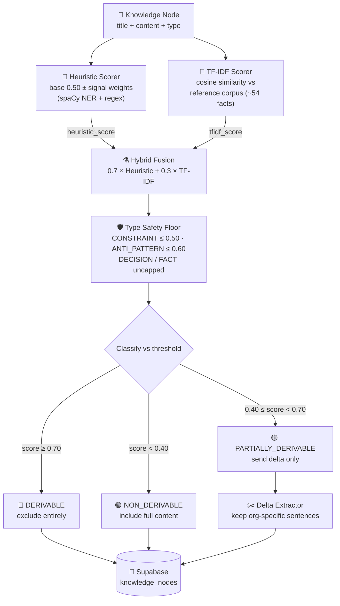
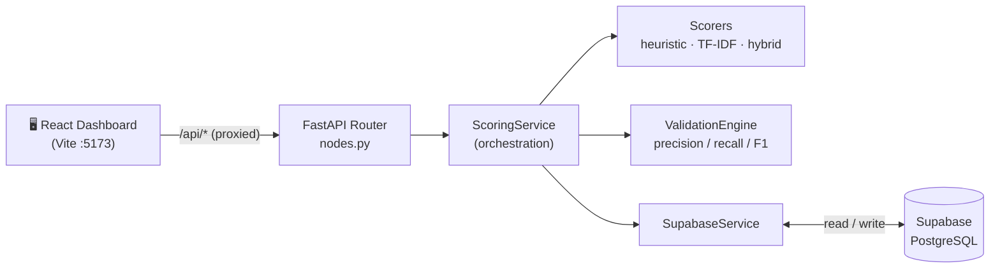
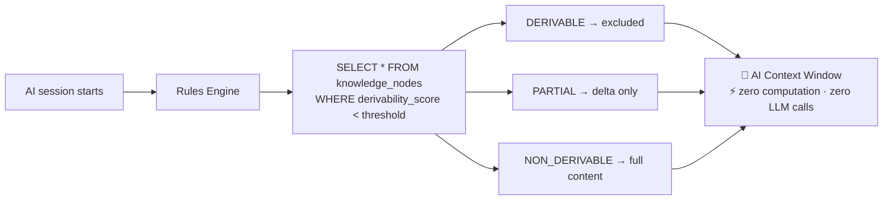
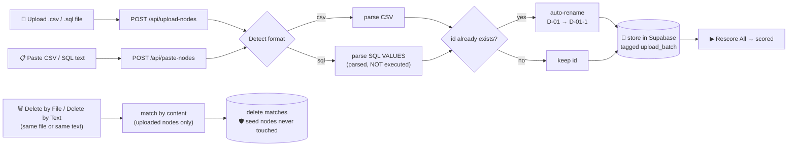

<div align="center">

# 🧠 BRAHMO Derivability Scoring System

### Token Savings Engine — Score Knowledge Without AI

A full-stack engine that pre-computes a **derivability score** (`0.0–1.0`) for every knowledge node and
classifies it as **DERIVABLE**, **PARTIALLY&nbsp;DERIVABLE**, or **NON&nbsp;DERIVABLE** — so general
knowledge the AI already knows is dropped from the context while org-specific and safety-critical
knowledge is always kept. **Zero LLM calls at query time.**

[](https://www.python.org/)
[](https://fastapi.tiangolo.com/)
[](https://react.dev/)
[](https://vitejs.dev/)
[](https://supabase.com/)
[](https://spacy.io/)
[](https://scikit-learn.org/)
[](#-license)

</div>

---

## 📑 Table of Contents

- [Overview](#-overview)
- [Key Features](#-key-features)
- [How It Works](#-how-it-works)
- [Architecture](#️-architecture)
- [Tech Stack](#-tech-stack)
- [Getting Started](#-getting-started)
- [Usage](#-usage)
- [Adding & Removing Nodes](#-adding--removing-nodes)
- [API Reference](#-api-reference)
- [Scoring Algorithm](#-scoring-algorithm)
- [Validation & Metrics](#-validation--metrics)
- [Token Savings & Cost Impact](#-token-savings--cost-impact)
- [Project Structure](#-project-structure)
- [Testing](#-testing)
- [Configuration](#-configuration)
- [Documentation](#-documentation)
- [License](#-license)

---

## 🎯 Overview

When an AI session starts at a hospital like *Supra Multi-Specialty*, a Rules Engine assembles candidate
knowledge nodes to put into the AI's context. Many of those nodes are **general knowledge the model
already learned during training** — *"What is a Total Knee Replacement?"*, *"Paracetamol mechanism of
action"*. Sending them again wastes tokens, and tokens cost money.

This system solves that problem **deterministically and cheaply**:

1. **Pre-scores** every node once using heuristic rules (spaCy NER + regex) + TF-IDF similarity.
2. **Classifies** each node as `DERIVABLE` (exclude), `PARTIALLY_DERIVABLE` (send only the org-specific
   delta), or `NON_DERIVABLE` (include in full).
3. **Persists** the score in the database, so query time is a single indexed
   `WHERE derivability_score < threshold` — **no computation, no LLM calls**.
4. **Protects safety** with type-based score ceilings, so safety-critical knowledge can never be
   accidentally dropped.

> **Core design principle:** wrongly dropping org-specific knowledge (a false positive) is **far more
> dangerous** than wrongly keeping general knowledge (a false negative). *When in doubt, keep the node.*

---

## ✨ Key Features

| | Feature | Description |
|---|---|---|
| ⚡ | **Zero-LLM scoring** | All scoring is heuristic + classical ML. No paid model calls — ever. |
| 🧮 | **Hybrid scorer** | Fuses rule-based signals (`0.7`) with TF-IDF similarity (`0.3`) for accuracy. |
| 🛡️ | **Type safety floors** | `CONSTRAINT` and `ANTI_PATTERN` nodes are capped so they can never be excluded. |
| ✂️ | **Delta extraction** | Partial nodes keep only their org-specific sentences, dropping the rest. |
| 📊 | **Validation matrix** | Live precision / recall / F1 + confusion matrix against ground truth. |
| 📈 | **Threshold analysis** | Sweeps thresholds and recommends the optimal one (max F1 @ precision ≥ 0.85). |
| 📥 | **Flexible ingestion** | Add nodes via file upload, pasted text, or directly in Supabase. |
| 🗑️ | **Safe deletion** | Remove uploaded nodes by re-supplying the same file/text — seed data is protected. |
| 🧪 | **Test Playground** | A dedicated tab to score any pasted content instantly (the live "surprise test") — nothing saved. |
| 🔍 | **Full explainability** | Every score carries the exact signals and matched text that produced it. |

---

## 🔬 How It Works

Each node travels through a deterministic pipeline. Three scorers cooperate, then a safety ceiling and a
threshold decide the node's fate:



> **Key heuristic signals:** org name `−0.40` · person / patient / incident `−0.30` · specific date
> `−0.20` · definition pattern `+0.30` · standard keyword `+0.20` — *13 signals total, see
> [`DOCUMENTATION.md`](DOCUMENTATION.md) §7.2.*

---

## 🏗️ Architecture

### Request flow (runtime)



### Query time — the payoff



`ScoringService` is the single orchestration layer — every endpoint flows through it. It builds a
per-organization `HybridScorer` using floors and thresholds from `organizations.config`, runs scoring,
persists results, and computes metrics, token savings, and threshold analysis.

---

## 📋 Tech Stack

| Layer | Technology | Purpose |
|-------|-----------|---------|
| **Backend** | Python 3.11+ · FastAPI | REST API & scoring pipeline |
| **NLP** | spaCy (`en_core_web_sm`) | Named-entity recognition, sentence segmentation |
| **ML** | scikit-learn | TF-IDF vectorizer + cosine similarity |
| **Database** | Supabase (PostgreSQL) | Node storage & score persistence |
| **Frontend** | React 18 + Vite 5 | Interactive dashboard |
| **Styling** | Tailwind CSS 3 | Utility-first styling |
| **Charts** | Chart.js + react-chartjs-2 | Threshold impact visualization |
| **Validation** | Pydantic v2 | Request/response schemas |
| **Testing** | pytest + httpx | Unit & integration tests |

---

## 🚀 Getting Started

### Prerequisites

- **Python** 3.11+
- **Node.js** 18+
- A free **[Supabase](https://supabase.com/)** project

### 1 · Database

In the Supabase **SQL Editor**, run the scripts in order:

```text
1. database/schema.sql      # creates tables (incl. the upload_batch column)
2. database/seed.sql        # loads 30 knowledge nodes
```

Verify: `SELECT COUNT(*) FROM knowledge_nodes;` → should return **30**.

### 2 · Backend

```bash
cd backend

python -m venv venv
venv\Scripts\activate                 # Windows
# source venv/bin/activate            # macOS / Linux

pip install -r requirements.txt
python -m spacy download en_core_web_sm   # REQUIRED — the scorer fails to import without it

cp .env.example .env                  # then add your Supabase credentials
uvicorn app.main:app --reload --port 8000
```

API → `http://localhost:8000`  ·  Interactive docs → `http://localhost:8000/docs`

### 3 · Frontend

```bash
cd frontend
npm install
npm run dev                           # http://localhost:5173 (proxies /api → :8000)
```

### 4 · Score everything

Click **Rescore All** in the dashboard, or:

```bash
curl -X POST http://localhost:8000/api/score-all \
  -H "Content-Type: application/json" \
  -d '{"algorithm": "hybrid", "threshold": 0.7, "org_id": "supra"}'
```

---

## 🖥️ Usage

The app has **two tabs**:

- **📊 Dashboard** — the full scoring view (panels below).
- **🧪 Test Playground** — paste or type any content and score it **instantly**; see the score,
  classification, sub-scores, the exact signals that fired, and the extracted delta. **Nothing is saved** —
  it's the live "surprise test" sandbox. Great for demos and experimenting.

The **Dashboard** tab is organized top-to-bottom:

| Panel | What it does |
|-------|--------------|
| **Controls** | Slide the **Derivability Threshold**, switch algorithm (Hybrid / Heuristic / TF-IDF), **Rescore All**. |
| **Upload / Paste Nodes** | Ingest new nodes via file or pasted text, and delete them again. |
| **Stats Cards** | Totals: derivable / partial / non-derivable counts and tokens saved. |
| **Scoring Detail — Per Node** | Sortable table; click any row for a full score breakdown and the extracted delta. |
| **Validation Matrix — Scorer Accuracy** | Confusion matrix + precision / recall / F1 gauges; flags false positives. |
| **Token Savings — Cost Impact** | Tokens saved and projected dollar savings at scale. |
| **Threshold Impact Analysis** | Chart of savings vs accuracy vs safety across thresholds, with the optimal mark. |

---

## 📥 Adding & Removing Nodes

The 30 seed nodes are **not** a fixed limit — added nodes join the same shared pool and are scored on the
next **Rescore All**. There are three ways to add and two ways to remove:



### Option A — Upload a file

In the **Upload Nodes** box: choose a `.csv` or `.sql` file → **Upload** → **Rescore All**.

- **CSV** — a header row matching the node columns. Template:
  [`database/nodes_import_template.csv`](database/nodes_import_template.csv).
- **SQL** — `INSERT INTO knowledge_nodes (...) VALUES (...)` statements, like
  [`database/seed.sql`](database/seed.sql). The values are **parsed, never executed**.

### Option B — Paste text

In the **Paste Nodes** box: paste one or many nodes as CSV or SQL text → pick the format (**Auto** detects
it) → **Save to Database** → **Rescore All**. This shares the exact same backend logic as file upload.

> 💡 **Try it instantly:** [`sample_datasets/paste_test_nodes.md`](sample_datasets/paste_test_nodes.md)
> contains 6 ready-to-paste nodes in **both** CSV and SQL — covering all three classes (DERIVABLE,
> NON_DERIVABLE, PARTIALLY_DERIVABLE). Copy either block straight into the box to test the feature.

### Option C — Directly in Supabase

Run `INSERT` statements in the SQL Editor (see
[`database/add_nodes_template.sql`](database/add_nodes_template.sql)), or use **Table Editor → Import data
from CSV**, then **Rescore All**.

### Ingestion behaviour

- Nodes are stored **unscored** (class `UNKNOWN`) until you run Rescore All.
- **No node is ever dropped** — a duplicate `id` is auto-renamed (`D-01` → `D-01-1`) and reported back.
- `org_id` defaults to `supra`; an invalid/missing `type` defaults to `FACT`; `importance` defaults to `0.5`.

| Column | Required? | Notes |
|--------|:---------:|-------|
| `id` | recommended | Auto-generated or renamed if missing/duplicate |
| `org_id` | no | Defaults to `supra` |
| `type` | no | `CONSTRAINT` / `DECISION` / `ANTI_PATTERN` / `FACT` (defaults to `FACT`) |
| `title` | yes\* | \*At least one of `title` or `content` is required |
| `content` | yes\* | The text that actually gets scored |
| `importance` | no | Defaults to `0.5` |
| `tokens_full`, `tokens_delta` | no | Power the **Token Savings** panel |
| `expected_derivability` | no | Ground truth — powers the **Validation Matrix** |

### Removing nodes

Give the **same input** again — **Delete by File** (choose the same file) or **Delete by Text** (paste the
same text). Nodes are matched **by content** (so renamed ids still match) and only uploaded/pasted nodes
are eligible — **the seed nodes are protected**. Re-supplying the input re-inserts the nodes.

> **One-time migration (recommended).** Seed protection relies on an `upload_batch` column. Run
> [`database/add_upload_batch_column.sql`](database/add_upload_batch_column.sql) once and restart the
> backend. The feature still works without it, but only *with* it are seed nodes guaranteed untouched.

### Sample datasets

Ready-made datasets for testing live in [`sample_datasets/`](sample_datasets/):

| File | Format | Theme | Nodes |
|------|--------|-------|:-----:|
| `cardio_pulmo_dataset.sql` | SQL (file upload) | Cardiology & Pulmonology | 15 |
| `peds_neuro_dataset.csv` | CSV (file upload) | Pediatrics & Neurology | 15 |
| `paste_test_nodes.md` | CSV **and** SQL (copy-paste) | Mixed — for the Paste Nodes box | 6 |

Each mixes clearly-derivable, non-derivable, and edge (partial) nodes.
[`paste_test_nodes.md`](sample_datasets/paste_test_nodes.md) holds the **same 6 nodes in both formats**,
ready to copy straight into the **Paste Nodes** box.

---

## 📊 API Reference

Base URL: `http://localhost:8000`  ·  Full OpenAPI/Swagger UI at `/docs`.

### Knowledge & scoring

| Method | Endpoint | Description |
|:------:|----------|-------------|
| `GET` | `/api/nodes` | List all knowledge nodes with their current scores |
| `POST` | `/api/score-all` | Score all nodes (batch) and persist results |
| `POST` | `/api/score-node` | Score a single node by id, or ad-hoc content (surprise test) |

### Ingestion & deletion

| Method | Endpoint | Description |
|:------:|----------|-------------|
| `POST` | `/api/upload-nodes` | Upload a CSV/SQL **file** of nodes (parsed & stored, unscored) |
| `POST` | `/api/paste-nodes` | Paste raw CSV/SQL **text** of nodes (parsed & stored, unscored) |
| `POST` | `/api/nodes/delete-by-file` | Delete uploaded nodes matching a re-supplied file |
| `POST` | `/api/nodes/delete-by-text` | Delete uploaded nodes matching re-pasted text |

### Analytics

| Method | Endpoint | Description |
|:------:|----------|-------------|
| `GET` | `/api/metrics` | Classification counts at a threshold |
| `GET` | `/api/validation-matrix` | Confusion matrix + precision / recall / F1 |
| `GET` | `/api/token-savings` | Token savings & cost projections |
| `GET` | `/api/threshold-analysis` | Threshold-vs-metrics data + optimal threshold |

### Health

| Method | Endpoint | Description |
|:------:|----------|-------------|
| `GET` | `/` | Service health check |
| `GET` | `/health` | Detailed health + endpoint list |

---

## 🧠 Scoring Algorithm

### Three configurable approaches

| Approach | How it works | Best for |
|----------|--------------|----------|
| **Heuristic** | spaCy NER + regex detect org names, people, dates, definitions | Fast, fully interpretable |
| **TF-IDF** | Cosine similarity to a general medical knowledge corpus | Ambiguous / novel phrasing |
| **Hybrid** *(default)* | `0.7 × Heuristic + 0.3 × TF-IDF` | Best overall accuracy |

### Heuristic signals (base score `0.50`)

| Signal | Weight | Example |
|--------|:------:|---------|
| Definition pattern (`X is a …`) | `+0.30` | "TKR is a surgical procedure…" |
| Standard / generic keywords | `+0.20` | "standard adult dose" |
| Medical terminology density | `+0.20` | High ratio of clinical terms |
| No org references | `+0.10` | — |
| **Organization name** | **`−0.40`** | "Supra uses…" |
| **Person name (spaCy NER)** | **`−0.30`** | "Dr. Vikram decided…" |
| **Incident / patient reference** | **`−0.30`** | "near-miss", "patient Sharma" |
| Specific date | `−0.20` | "January 2025" |
| Decision rationale | `−0.20` | "because", "approved" |
| Specific counts / money | `−0.10` | "8 refusals", "₹5,000" |

### Type safety floors (hard ceilings, applied after fusion)

| Node Type | Max Score | Rationale |
|-----------|:---------:|-----------|
| `CONSTRAINT` | **0.50** | Safety-critical rule — can never be excluded |
| `ANTI_PATTERN` | **0.60** | Past incidents must be preserved |
| `DECISION` | no cap | Already penalized by org-specific signals |
| `FACT` | no cap | General facts can be fully derivable |

### Classification thresholds (asymmetric)

```text
score ≥ threshold (0.70)   →  DERIVABLE             (exclude — save all tokens)
0.40 ≤ score < threshold   →  PARTIALLY_DERIVABLE   (keep delta — save the rest)
score < 0.40               →  NON_DERIVABLE         (keep full — save nothing)
```

---

## 📈 Validation & Metrics

The **ValidationEngine** compares each scored class against the ground-truth `expected_derivability`
column to build a confusion matrix and derive metrics:

| Metric | Formula | Target | Meaning |
|--------|---------|:------:|---------|
| **Precision** | `TP / (TP + FP)` | **≥ 85%** | Of nodes we excluded, how many were truly safe to exclude |
| **Recall** | `TP / (TP + FN)` | ≥ 70% | Of nodes that were safe to exclude, how many we caught |
| **F1 Score** | `2·P·R / (P + R)` | — | Balance of precision and recall |
| **False Positive Rate** | `FP / (FP + TN)` | **< 5%** | How often we dangerously excluded org-specific knowledge |

> A **false positive** (excluding org-specific knowledge) is the critical failure mode. The dashboard
> flags it in red, and the **optimal threshold** is chosen as *max F1 subject to precision ≥ 0.85* — safety
> first, savings second.

### Threshold Impact Analysis

`compute_threshold_analysis` sweeps **12 thresholds** (`0.40 → 0.95`). At each one it re-classifies every
node, totals the token savings, and re-runs the confusion matrix — exposing the savings-vs-safety
trade-off and letting `find_optimal_threshold` recommend the best cut-off.

---

## 💰 Token Savings & Cost Impact

Savings are computed per class — `DERIVABLE` saves all `tokens_full`, `PARTIALLY_DERIVABLE` saves
`tokens_full − tokens_delta`, `NON_DERIVABLE` saves nothing — and projected using GPT-4 pricing
(`$0.015 / 1K tokens`), 10 sessions/day, 250 working days/year.

With the 30 seed nodes at the default threshold (`0.70`):

| Metric | Value (approx.) |
|--------|-----------------|
| Total tokens | ~1,800 |
| Tokens saved | ~600 (≈34.5%) |
| Per-session savings | ~$0.009 |
| Annual savings — 50 engineers | ~$1,125 |
| Annual savings — 500 engineers | ~$11,250 |

---

## 📁 Project Structure

```text
brahmo-derivability/
├── backend/
│   ├── app/
│   │   ├── main.py                          # FastAPI entry point + CORS
│   │   ├── api/routers/nodes.py             # All REST endpoints
│   │   ├── services/
│   │   │   ├── scoring_service.py           # Orchestration + import/delete logic
│   │   │   ├── node_parser.py               # CSV/SQL parser (SQL parsed, not executed)
│   │   │   └── supabase_client.py           # Database access layer
│   │   ├── models/schemas.py                # Pydantic v2 models
│   │   ├── scorer/
│   │   │   ├── heuristic_scorer.py          # Rule-based scoring (spaCy + regex)
│   │   │   ├── embedding_scorer.py          # TF-IDF similarity scorer
│   │   │   ├── hybrid_scorer.py             # Fusion + type floors + classification
│   │   │   ├── delta_extractor.py           # Org-specific portion extraction
│   │   │   └── reference_corpus.py          # General-knowledge corpus (~54 entries)
│   │   ├── validators/validation_engine.py  # Confusion matrix, precision/recall/F1
│   │   └── utils/token_counter.py           # Token counting & cost projections
│   ├── tests/                               # pytest suite
│   ├── requirements.txt
│   └── .env.example
├── frontend/
│   ├── src/
│   │   ├── App.jsx                          # Root component, state & tab switching
│   │   ├── components/                      # 11 React components
│   │   │   ├── Header.jsx                   # Branding + status
│   │   │   ├── Controls.jsx                 # Threshold slider + algorithm selector
│   │   │   ├── UploadNodes.jsx              # CSV/SQL file upload + Delete by File
│   │   │   ├── PasteNodes.jsx               # Paste CSV/SQL text + Delete by Text
│   │   │   ├── TestPlayground.jsx           # 🧪 live ad-hoc scorer tab (no DB write)
│   │   │   ├── StatsCards.jsx               # Summary metric cards
│   │   │   ├── NodeTable.jsx                # Sortable per-node scoring table
│   │   │   ├── NodeModal.jsx                # Node detail + delta breakdown
│   │   │   ├── ValidationMatrix.jsx         # Confusion matrix + gauges
│   │   │   ├── ThresholdChart.jsx           # Chart.js threshold analysis
│   │   │   └── TokenSavings.jsx             # Cost projections
│   │   └── api/client.js                    # Single API client
│   ├── package.json
│   ├── vite.config.js                       # Vite + /api proxy
│   └── tailwind.config.js
├── database/
│   ├── schema.sql                           # Table definitions (incl. upload_batch)
│   ├── seed.sql                             # 30 knowledge nodes + ground truth
│   ├── add_upload_batch_column.sql          # Migration: enables seed-protected deletes
│   ├── add_nodes_template.sql               # SQL template for adding nodes
│   └── nodes_import_template.csv            # CSV template for upload/import
├── sample_datasets/                         # Ready-made datasets for upload testing
├── DOCUMENTATION.md                         # Full design + evaluation reference
├── EXPLANATION.md                           # File-by-file walkthrough (plain language)
├── CLAUDE.md                                # Guide for Claude Code / AI agents
└── README.md                                # This file
```

---

## 🧪 Testing

```bash
cd backend

python -m pytest tests/ -v                          # all tests
python -m pytest tests/test_heuristic_scorer.py -v  # a single file
python -m pytest tests/test_surprise_nodes.py -v    # ad-hoc "surprise" content scoring
```

The pure scorer tests run offline. `tests/test_api.py` needs a live Supabase connection.

---

## 🔒 Configuration

Backend reads credentials from `backend/.env` (see `.env.example`):

| Variable | Description | Example |
|----------|-------------|---------|
| `SUPABASE_URL` | Supabase project URL | `https://xxxx.supabase.co` |
| `SUPABASE_KEY` | Supabase anon/public key | `eyJhbG…` |
| `DEFAULT_ORG_ID` | Default organization id | `supra` |

Per-organization scoring config (threshold + type floors) lives in the `organizations.config` JSON column,
so behaviour can be tuned per org without code changes.

---

## 📚 Documentation

| Document | Purpose |
|----------|---------|
| [`DOCUMENTATION.md`](DOCUMENTATION.md) | Full design reference, evaluation criteria, demo scenarios |
| [`EXPLANATION.md`](EXPLANATION.md) | Plain-language, file-by-file walkthrough with diagrams |
| [`INTERVIEW_PREP.md`](INTERVIEW_PREP.md) | Beginner-friendly concepts (precision/recall/TF-IDF) + full interview Q&A |
| [`CLAUDE.md`](CLAUDE.md) | Architecture & invariants for AI coding agents |
| `/docs` (runtime) | Interactive Swagger / OpenAPI UI |

---

## 📄 License

This project was built as part of the **BRAHMO Knowledge Infrastructure** assessment.

---

<div align="center">

**BRAHMO Derivability Scoring System** · Token Savings Engine

*Zero LLM at query time • Pre-computed scores • Type safety floors*

</div>
